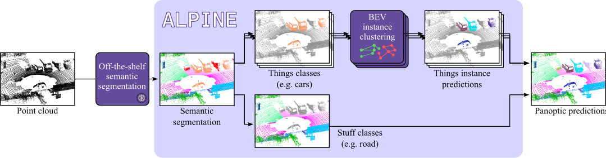

# Clustering is back: Reaching state-of-the-art LiDAR instance segmentation without training

Official implementation of the method **ALPINE**. Check out the article for more details!

**Clustering is back: Reaching state-of-the-art LiDAR instance segmentation without training**,
by *Corentin Sautier, Gilles Puy, Alexandre Boulch, Renaud Marlet, and Vincent Lepetit*



ALPINE takes semantic LiDAR predictions as input, and predicts instance masks, evaluated on LiDAR panoptic benchmarks. 

If you use ALPINE in your research, please cite:
```
@article{sautier2025alpine,
  title = {Clustering is back: Reaching state-of-the-art {LiDAR} instance segmentation without training},
  author = {Corentin Sautier and Gilles Puy and Alexandre Boulch and Renaud Marlet and Vincent Lepetit},
  journal={arxiv},
  year = {2025}
}
```

## Using Alpine in your own codebase

First install Alpine using:

`pip install .`

Alpine's usage is similar to other scikit-learn clustering:

```
from alpine import Alpine
# Provide your own point cloud X and semantic labels y
X = np.array([[0, 0], [1, 1], [2, 2], [3, 3]])
y = np.array([0, 0, 1, 1])
# Provide a list of 'thing' classes matching separable objects in your semantic labels
thing_indexes = [0, 1]
# Provide a dict of standard size of object for each 'thing' class
thing_bboxes = {0: [2., 2.], 1: [2., 2.]}
alpine = Alpine(thing_indexes, thing_bboxes, split=True)
instance_labels = alpine.fit_predict(X, y)
```

Other parameters include whether or not to activate the box splitting (default is false), the number of neighbors k and the margin of the box splitting.

## Evaluation Alpine in our codebase

### Datasets

This project has been adapted to [SemanticKITTI](http://www.semantic-kitti.org/tasks.html#semseg), [nuScenes](https://www.nuscenes.org/lidar-segmentation) and [SemanticPOSS](http://www.poss.pku.edu.cn/semanticposs.html). Please use the following convention (or provide the `--path_dataset` argmument):

```
UNIT
├── datasets
│   ├── nuscenes
│   │   │── v1.0-trainval
│   │   │── samples
│   │   │── sweeps
│   ├── semantic_kitti
│   │   │── sequences
│   ├── semantic_poss
│   │   │── sequences
```

### Use your own semantic masks

For SemanticKITTI and SemanticPOSS, you should preferably use the [official prediction formatting](http://www.semantic-kitti.org/dataset.html#format) requested by SemanticKITTI.

For nuScenes you can either use the [semantic segmentation formatting](https://www.nuscenes.org/lidar-segmentation//#results-format) or the [panoptic segmentation formatting](https://www.nuscenes.org/panoptic/#results-format).

### Running ALPINE

ALPINE can be ran with the command:

`python alpine_semantickitti.py --path_to_files [path] --split`

Other arguments can disable the box splitting for faster runtime at some performance cost, or save the predictions to disk.

### Running ALPINE with WaffleIron predictions

To obtain semantic predictions on SemanticKITTI using [WaffleIron](https://github.com/valeoai/WaffleIron), first install WaffleIron and its dependencies, then you can run the following code:

```
cd waffleiron

wget https://github.com/valeoai/WaffleIron/releases/download/v0.2.0/waffleiron_kitti.tar.gz
tar -xvzf waffleiron_kitti.tar.gz

python predict_semantickitti.py \
--path_dataset ../semantic_kitti/ \
--ckpt ./pretrained_models/WaffleIron-48-256__kitti/ckpt_last.pth \
--config WaffleIron-48-256__kitti.yaml \
--result_folder ./predictions_kitti \
--phase val \
--num_votes 12 \
--num_workers 6
```

Predicted semantic segments will be generated in *waffleiron/predictions_kitti* and can be evaluated running:

`python alpine_semantickitti.py --path_to_files waffleiron/predictions_kitti --split`

### Ensembling

In the article, we ran ensembling by summing predicted semantic probabilities together. To obtain this behavior, you can provide multiple *path_to_files* with output probabilities. This ensembling method might not be effective for any combination of predictions.

## Acknowledgement

We want to acknowledge the authors of [MODEST](https://github.com/YurongYou/MODEST/) from which we reuse a box fitting algorithm.

We incorporated a minimal working example of [WaffleIron](https://github.com/valeoai/WaffleIron/) into this repository to provide working semantic masks.
